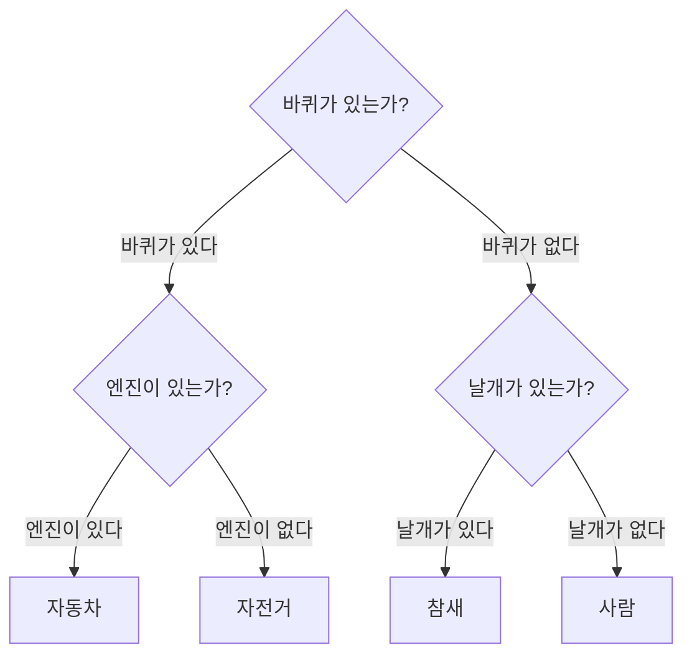

# 차례
## [１. 머신러닝과 딥러닝](#1-머신-러닝과-딥러닝)
<details open>
  <summary style='background-color: #3498db;
    color: #fff;
    padding: 10px 20px;
    cursor: pointer;
    border-radius: 16px;
    outline: none;'>
    펼치기/접기
  </summary>

  [1-1. 머신 러닝과 딥러닝의 차이](#1-1-머신-러닝과-딥러닝의-차이)
</details>

## [２. 파이토치 기초](#2-파이토치-기초)
<details open>
  <summary style='background-color: #3498db;
    color: #fff;
    padding: 10px 20px;
    cursor: pointer;
    border-radius: 16px;
    outline: none;'>
    펼치기/접기
  </summary>


[2-1. 파이토치 특징 (09.04)](#2-1-파이토치-특징-0904)

[2-2. 파이토치 데이터셋 (09.04)](#2-2-파이토치-데이터셋-0904)

[2-3. 파이토치 모델 (09.04)](#2-3-파이토치-모델-0905)
</details>

## [３. 머신 러닝 알고리즘](#3-머신-러닝-알고리즘)
<details open>
  <summary style='background-color: #3498db;
    color: #fff;
    padding: 10px 20px;
    cursor: pointer;
    border-radius: 16px;
    outline: none;'>
    펼치기/접기
  </summary>

  [3-1. 지도학습 (09.05)](#3-1-지도학습-0905)

  * [3-1-1. k-최근접 이웃(knn) (09.05)](#3-1-1-k-최근접-이웃knn-0905)

  * [3-1-2. 서포트 벡터(SVM) (09.06)](#3-1-2-서포트-벡터-머신svm-0906)

  * [3-1-3. 결정 트리 (09.06)](#3-1-3-결정-트리-0906)

  * [3-1-4. 로지스틱 회귀 (09.06)](#3-1-4-로지스틱-회귀-0906)

  * [3-1-5. 선형 회귀 (09.06)](#3-1-5-선형-회귀-0906)

  [3-2. 비지도 학습 (09.06)](#3-2-비지도학습-0906)

  * [3-2-1. K-평균 군집화(KMC) (09.06)](#3-2-1-k-평균-군집화-0906)

  * [3-2-2. 주성분 분석(PCA) (09.06)](#3-2-2-주성분-분석pca-0906)
</details>

## [４. 딥러닝 시작](#4-딥러닝-시작)
<details open>
  <summary style='background-color: #3498db;
    color: #fff;
    padding: 10px 20px;
    cursor: pointer;
    border-radius: 16px;
    outline: none;'>
    펼치기/접기
  </summary>

[4-1. 인공 신경망의 한계와 딥러닝의 출현 (09.07)](#4-1-인공-신경망의-한계와-딥러닝의-출현-0907)

[4-2. 딥러닝 구조 (09.07)](#4-2-딥러닝-구조-0907)

[4-2-1. 활성화 함수 (09.07)](#4-2-1-활성화-함수-0907)

[4-2-2. 손실함수 (09.07)](#4-2-2-손실함수-0907)

[4-2-3. 딥러닝 학습 (09.07)](#4-2-3-딥러닝-학습-0907)

[4-3. 딥러닝 신경망의 종류 (09.07)](#4-3-딥러닝-신경망의-종류-0907)
</details>

## [５. 합성곱 신경망 (09.07)](#5-합성곱-신경망)
<details open>
  <summary style='background-color: #3498db;
    color: #fff;
    padding: 10px 20px;
    cursor: pointer;
    border-radius: 16px;
    outline: none;'>
    펼치기/접기
  </summary>

[5-1. 합성곱 신경망 특징 (09.07)](#5-1-합성곱-신경망-특징-0907)

[5-2. 합성곱 신경망 실습 (09.07)](#5-2-합성곱-신경망-실습-0907)
</details>

## #1. 머신 러닝과 딥러닝
### #1-1. 머신 러닝과 딥러닝의 차이


## #2. 파이토치 기초
### #2-1. 파이토치 특징 (09.04)
파이토치는 CPU/GPU 자원을 이용하여 텐서 조작 및 동적 신경망을 구축할 수 있는 프레임워크중 하나이다
파이토치는 Autograd, Aten, JIT 등의 C++ 엔진 등의 다양한 아키텍처로 이뤄져 있다.

파이토치에서는 기본적으로 텐서 연산 및 텐서 조작이 가능하다

------------------
### #2-2. 파이토치 데이터셋 (09.04)
파이토치를 사용하기에 앞서, 모델에 필요한 데이터셋을 불러올 때, 메모리에서 한번에 불러올 경우, 프로그램이 멈추거나 하는 등 효율적이지 않기 때문에 `데이터셋`을 만들어 사용한다.

또한 파이토치에서 제공하는 MNIST 등을 사용할 수도 있다
``` python
# 데이터셋 예시
class MyDataset(Dataset):
    def __init__(self, csv_file):
        self.label = pd.read_csv(csv_file)
    
    def __len__(self):
        return len(self.label)
    
    def __getitem__(self, idx):
        sample = torch.tensor(self.label.iloc[idx, 0:3]).int()
        label = torch.tensor(self.label.iloc[idx, 3]).int()
        return sample, label
tensor_dataset = MyDataset('./test.csv')
dataset = DataLoader(tensor_dataset, batch_size=4, shuffle=True)
```

------------
### #2-3. 파이토치 모델 (09.05)
모델은 다음과 같은 요소들로 이뤄져 있다.
* 계층(layer):
    * 가중치(weight) 와 편차(bias) 를 가져 연산을 수행한다
    * 특정 개수의 입력 노드로부터 연산을 거쳐, 또 다른 개수의 출력노드로 값이 도출된다
    * 합성곱층, 선형계층 등이 있다
* 모듈(module):
    * 계층이 모여 구성된 것으로, 모듈이 모여 모듈을 구성할 수 있다
* 모델(model):
    * 최종적으로 원하는 네트워크로, 한 개의 모듈이 모델 그 자체가 될 수도 있다

모델을 구현할 때, 대부분 Module 을 상속받아 사용하는데 그 경우 `__init__` 에서 모듈, 활성화 함수 등을 정의하고, `forawrd` 에서는 모델에서 실행될 연산을 정의한다
```python
# single layer, single module
class SLP(nn.Module):
    def __init__(self, inputs):
        super().__init__()
        self.layer = nn.Linear(
            in_features=inputs, 
            out_features=1
        )
        self.activation = nn.Sigmoid
    
    def forward(self, x):
        x = self.layer(x)
        x = self.activation(x)
        return x

# multi layer, single module
class MLP(nn.Module):
    def __init__(self):
        super().__init__()
        self.layer1 = nn.Sequential(
            nn.Conv2d(
                in_channels=3,
                out_channels=64,
                kernel_size=5
            ),
            nn.ReLU(inplace=True),
            nn.MaxPool2d(2)
        )
        self.layer2 = nn.Sequential(
            nn.Conv2d(
                in_channels=64,
                out_channels=30,
                kernel_size=5
            ),
            nn.ReLU(inplace=True),
            nn.MaxPool2d(2)
        )
        self.layer3 = nn.Sequential(
            nn.Linear(
                in_features=30 * 5 * 5,
                out_features=10
            ),
            nn.ReLU(inplace=True),
            nn.MaxPool2d(2)
        )
    
    def forward(self, x):
        x = self.layer1(x)
        x = self.layer2(x)
        x = x.view(x.shape[0], -1)
        x = self.layer3(x)
        return x
```

## #3. 머신 러닝 알고리즘
### #3-1. 지도학습 (09.05)
지도학습은 모델을 훈련할 때, 사전에 입력되는 데이터에 정답을 알려 주고 학습을 하는 방법이다

지도학습의 종류
- 분류
    - 이산형 데이터를 받아 사전에 훈련받은 데이터들의 레이블 중 하나로 예측하는 방식이다
- 회귀
    - 연속된 데이터를 받아 연속된 값을 예측하여 연속된 값을 예측하는 방식으로, 보통 흐름에 따라 연속적으로 변하는 값을 예측할 때 사용한다

### 3-1-1. k-최근접 이웃(KNN) (09.05)
k 최근접 이웃은 미리 라벨이 붙은 클러스터 들 중에, 새로운 입력 데이터가 있으면 해당 데이터 근처 `k`개의 데이터를 보고, 새로운 데이터에 어떤 라벨이 붙일지를 정하는 알고리즘 이다

k값에 따라 비교할 데이터 대상이 달라져 결과가 크게 달라짐으로 초기 설정이 중요하다


``` python
# 모델을 생성 및 훈련하고, 정확도를 계산하는 예시
classifier = KNeighborsClassifier(n_neighbors = k).fit(x_train, y_train)
y_pred = classifier.predict(x_test)
acc = metrics.accuracy_score(y_test, y_pred)
```

-----
### #3-1-2. 서포트 벡터 머신(SVM) (09.06)
서포트 벡터 머신이란, 데이터 클러스터에서 분류를 위한 기준점인 `결정 경계`를 결정하는 알고리즘이다

결정 경계로부터 가장 가까이 있는 데이터를 `서포트 벡터` 라고 하고, 서포트 벡터와 결정 경계 사이의 거리를 `마진` 이라고 하는데

최적의 결정 경계를 정하기 위해서는 마진이 최대가 되도록 해야 한다
``` python
# SVM 모델 생성 및 훈련 예시
svm = svm.SVC(kernel='linear', C=1, gamma=0.5)
# 훈련 데이터로 svm 모델 훈련
svm.fit(x_train, y_train)
# 테스트데이터로 예측
predictions = svm.predict(x_test)
score = metrics.accuracy_score(y_test, predictions)
```
예시에서 보면 `c` 와 `gamma` 가 있는데

`C` 값은 오류를 얼마나 허용할지를 정하는 파라미터이며, 클 수록 하드마진이다

`gamma` 값은 각 결정 경계를 얼마나 유연하게 가져갈지, 즉 경계의 곡선이 얼마나 휘어질지를 정하는 파라미터로 값이 클수록 급격하게 휜다.
하지만 해당 값이 너무 클 경우, 훈련 데이터에 많이 의존하기 때문에 과적합을 초래할 수 있으니 주의해야 한다


### ※ 추가 정보
비선형 문제, 즉 결정 곡선이 비선형일 때 찾는 방법이 저차원 데이터를 고차원으로 보내는 것인데, 이것은 연산량이 너무 많아 다음과 같은 커널 트릭으로 해결한다

>선형 커널(linear kernel): 
>   > 선형으로 분류 가능한 데이터에 적용하며 커널 트릭을 사용하지 않겠다는 의미이다.
>   >
>   > $$K(a, b) = a^T * b$$
>   >
>   > $(a, b)$는 입력 벡터

> 다항식 커널(polynomial kernel):
>   > 실제로는 특정을 추가하지 않지만, 다항식 특성을 많이 추가한 것과 같은 결과를 얻을 수 있는 방법이다. 때문에 고차원 매핑이 가능하다
>   >
>   > $$K(a, b) = (\gamma a^t * b)^d$$
>   >
>   > $\begin{pmatrix} a, b & 입력 벡터 \\ \gamma & 감마 \\ d  & 차원 \end{pmatrix}$ 단, 이때 $\gamma, d$는 하이퍼파라미터

> 가우시안 RBF 커널(Gaussian RBF kernel):
>   > 입력 벡터를 차원이 무한한 고차원으로 매핑하는 것으로 모든 차수의 모든 다항식을 고려, 다항식 커널은 차수에 한계가 있는 문제를 해결
>   > 
>   > $$K(a, b) = \exp(-\gamma \rVert a= b\rVert ^ 2)$$
>   >
>   > 이때 $\gamma$ 는 하이퍼파라미터

--------
### #3-1-3. 결정 트리 (09.06)
결정 트리는 데이터를 분류하거나 결과를 예측하는 분석 방법이다

_결정 트리 예시_

| 자동차 | 자전거 | 참새 | 사람 |
| - | - | - | - |
| 엔진이 있다 | 엔진이 없다 | 날개가 있다 | 날개가 없다 |
| 바퀴가 있다  | ` | 바퀴가 없다 | ` |

결정 트리는 데이터를 1차로 분류한 후 각 영역의 순도가 증가하고, 불순도와 불확실성은 감소하는 방향으로 학습을 진행시킨다.

이중, 순도는 범주 안에 같은 데이터가 모여있는 정도이고 불순도는 계산을 통해 구한다
``` python
# 결정 트리 예시
# 결정 트리 모델 생성
model = tree.DecisionTreeClassifier()

# 모델 훈련
model.fit(x_train, y_train)

# 모델 예측
y_predict = model.predict(x_test)
print(accuracy_score(y_test, y_predict))

# 혼동 행렬로 성능측정
print(pd.DataFrame(
    confusion_matrix(y_test, y_predict),
    columns=['Pred Negative', 'Pred Positive'],
    index=['Actual Negative', 'Actual Positive']
))
```
※ 혼동 행렬이란 True/False, Positive/Negative 의 조건으로
* 예측값이 Positive 인데 실제값도 Positive 인 경우
* 예측값이 Positive 인데 실제값은 Negative 인 경우
* 예측값이 Negative 인데 실제값은 Positive 인 경우
* 예측값이 Negative 인데 실제값도 Negative 인 경우

를 표현하는 행렬이다

----
### #3-1-4. 로지스틱 회귀 (09.06)
회귀란 두 변수에서 한 변수로 다른 변수를 예측하거나 두 변수의 관계를 규명할 때 사용하는 방법으로 이 때 사용하는 변수는 다음과 같다
* **독립 변수(예측 변수)**: 영향을 미칠 것으로 예상되는 변수
* **종속 변수(기준 변수)**: 영향을 받을 것으로 예상되는 변수

예시로는 몸무게(종속 변수) 와 키(독립 변수)가 있다

로지스틱 회귀는 일반적인 회귀와는 다르게 **분석하고자 하는 대상들이 두 집단 혹은 그 이상의 집단으로 나누어진 경우, 개별 관측치들이 어느 집단으로 분류될 수 있는지 분석하고 이를 예측하는 모형을 개발**하는데 사용되는 통계 기법이다.
``` python
#로지스틱 회귀 모델

# 로지스틱 회귀 모델 생성
logisticRegr = LogisticRegression()

# 훈련
logisticRegr.fit(x_train, y_train)

# 테스트셋을 사용해 모델 예측
predictions = logisticRegr.predict(x_test)
score = logisticRegr.score(x_test, y_test)
print('score: ', score)
# 추가적으로 혼동행렬을 이용해 시각화 할 수도 있다
```

---
### #3-1-5. 선형 회귀 (09.06)
선형 회귀는 독립 변수와 종속 변수가 선형 관계를 가질 때 사용하면 유용하며, 선형 특징상 복잡한 과정이 없어 제한된 환경에서도 사용할 수 있다

로지스틱 회귀와의 차이는 선형 회귀는 변수 x 와 y 의 관계가 직선으로 나타나며 때문에 예측값 y는 0~1 을 초과할 수 있다

하지만 로지스틱 회귀는 x 와 y 의 관계가 S-커브 로 나타나며 예측값은 0~1 사이이다 (종속변수가 예/아니오 로 나타나기 때문)
``` python
# 선형 회귀 모델

# 선형 회귀 모델 생성
regressor = LinearRegression()

# 훈련
regressor.fit(x_train, y_train)

# 모델 예측
y_pred = regressor.predict(x_test)
df = pd.DataFrame({'Actural': y_test.flatten(), 'Predicted': y_pred.flatten()})
print(df)

# 테스트셋으로 회귀선 표현
plt.scatter(x_test, y_test, color='gray')
plt.plot(x_test, y_pred, color='red', linewidth=2)
plt.show()
```

선형 회귀 모델을 평가할 때는 평균 제곱법과 루트평균 제곱법을 사용하여 모델을 평가한다

평균 제곱법이 $\mathrm{MSE} = \frac{1}{n}\sum_{l=1}^N(y_i- \check{y_i})^2$ 라면,

루트 평균 제곱법은 $\mathrm{RMSE} = \sqrt{\frac{1}{n}\sum_{l=1}^N(y_i- \check{y_i})^2}$ 로 전체에 루트만 씌운것과 같다

---
### #3-2. 비지도학습 (09.06)
비지도 학습은 분류되거나 레이블을 붙이지 않은 데이터로 훈련시키는 학습이며 

비지도 학습에는 군집(cluster)과 축소(dimensionality reduction) 이 있다

군집은 데이터를 그룹화 하여 분류하는데 사용하고,

차원 축소는 데이터를 압축하거나, 필요한 속성을 도출해내는데 사용한다

---
### #3-2-1. K 평균 군집화 (09.06)
K 평균 군집화는 데이터를 입력받아 여러 그룹으로 묶는 알고리즘 이다.

해당 알고리즘은 데이터를 받아 각 데이터에 레이블을 할당해 클러스터링을 수행하는데 학급 과정은 다음과 같다.
1. **중심점 선택**: 랜덤하게 초기 중심점을 K개 선택한다
2. **클러스터 할당**: K개의 중심점과 각각 데이터간의 거리를 측정 후, 가장 가까운 중심점을 기준으로 데이터를 할당 하는것으로 클러스터화 하여 레이블을 할당한다
3. **새로운 중심점 선택**: 클러스터마다 새로운 중심점을 계산한다.
4. **범위 확인**: 선택된 중심점에 변화가 없다면 진행을 멈추고, 있다면 2~3 과정을 반복한다

하지만 K-평균 군집화 알고리즘은 다음 상황에서는 사용하지 않는것이 권장된다
* **데이터가 비선형일때**: 해당 알고리즘은 각 클러스터간의 거리가 가장 중요하게 동작하는데, 거리라는 조건에 따라 클러스터를 설정하는 행위는 선형적이라고까지 할 수 있게 동작하기 때문에, 데이터가 비 선형적이라면 클러스터가 정상적으로 형성되지 않을 가능성이 높다
* **군집 크기가 다를때**: 군집 크기가 다르다면 자연스레 큰 군집의 외각에 있는 데이터가 해당 클러스터의 중심점과 거리가 멀어 다른 클러스터로 합쳐질 가능성이 높은데, 해당 경우가 많이 발생하면 클러스터가 원하는 대로 형성되지 않게 된다
* **군집마다 밀집도와 거리가 다를 때**: 위와 거의 동일하다. 밀집도가 낮은 클러스터의 외각에 있는 데이터는 해당 클러스터의 중심점과 거리가 멀어 다른 클러스터와 합쳐지며 데이터가 오염된다
``` python
#KMC
km = KMeans(n_clusters=k)
km = km.fit(data_transformed)
print('거리 제곱의 합:', km.inertia_)
```
거리 제곱의 합(Sum of Squared Distances) 은 가장 가까운 클러스터 중심까지 거리를 제곱한 값을 구할 때 사용하며 다음과 같은 수식이다
$$\mathrm{SSD} = \sum_{x, y} (I_1(x, y) - I_2(x, y))^2$$
K 값이 증가하면 당연히 클러스터의 개수가 많아지며 SSD는 0에 가까워지는 경향이 있다

**※ 추가 정보**

KMC 의 단점으로 소수의 데이터가 적절한 클러스터와 거리가 멀리 떨어져 있는, 즉 오목하거나 볼록한 부분을 잘 처리하지 못한다는 점이 있는데
연산량은 조금 더 많지만 이런 노이즈와 이상치를 잘 처리할 수 있는 `밀도 기반 군집 분석 (DBSCAN)` 이 있다

---
### #3-2-2. 주성분 분석(PCA) (09.06)
PCA 는 고차원 데이터에서는 중요하지 않은 변수가 많아지고 성능도 나빠지는 경향이 있어 고차원 데이터를 저차원으로 축소시켜 데이터의 대표 특성만 추출하는 알고리즘 이다.

차원 축소는 다음과 같은 단계로 진행된다
1. **데이터들의 분포 특성을 잘 설명하는 벡터 2개 선택**:
간단하게는 원형으로 된 클러스터가 있다면 원의 중심을 수직으로 지나는 벡터 2개를 예시로 들 수 있는데, 해당 벡터들의 방향과 크기로 클러스터의 위치, 모양을 예상할 수 있기 때문이다
2. **벡터 2개를 위한 가중치를 찾을 때까지 학습**:
즉 PCA는 데이터 하나하나의 성분이 아닌, 여러 데이터가 모인 클러스터에서 해당 클러스터의 주성분을 분석하는 방법이기 때문이다
``` python
# PCA 학습 예시
# 2차원으로 차원 축소 선언
pca = PCA(n_components=2)
x_principal = pca.fit_transform(x_normalized)
x_principal = pd.DataFrame(x_principal)
x_principal.columns = ['P1', 'P2']

# 모델 튜닝
db = DBSCAN(eps=0.0375, min_samples=50).fit(x_principal)
# min_samples 수를 변경해서 큰 값을 넣는다면 작은 규모의 클러스터가 무시된다

labels = db.labels_

colors = ['r', 'g', 'b', 'c', 'y', 'm', 'k']
cvec = [colors[l] for l in labels]

plt_color = [
    plt.scatter(x_principal['P1'], x_principal['P2'],marker='o', color=c)
        for c in colors1
]
plt.figure(figsize=(9, 9))
plt.scatter(x_principal['P1'], x_principal['P2'], c=cvec)
plt.legend(
    plt_color,
    ['Label' + str(i) for i in range(7)],
    scatterpoints=1,
    loc='upper left',
    ncol=3,
    fontsize=8
)
plt.show()
```

---
## #4. 딥러닝 시작
### #4-1. 인공 신경망의 한계와 딥러닝의 출현 (09.07)
오늘날 인공 신경망의 시초는 1957년에 고안된 `퍼셉트론` 이라는 머신으로부터 시작되었는데.

퍼셉트론의 원리는 입력노드 n개의 $x_1, x_2$ 로부터 1 또는 0을 받아 앞으로 전달하는 원리로 동작한다.

이 퍼셉트론을 이용하여 and, or 게이트의 경우에는 $x_1, x_2$ 의 그래프가 선형으로, 좌표평면에 분명하게 구분지어 지는데 XOR 게이트 같이 데이터가 비 선형적으로 분리되는 경우에는 학습이 불가능했다.

그래서 이를 해결하기 위해 입력 레이어와 출력 레이어 사이 하나 이상의 은닉 레이어를 두어 비선형적 데이터에 대해서도 학습이 가능하도록 `다층 퍼셉트론` 머신을 고안했다.

그리고 이렇게 은닉층이 여러 개 있는 신경망을 심층 신경망(Deep Neural network, DNN) 이라고 하며 이를 또 다른 이름으로는 딥 러닝이라고 한다.

---
### #4-2. 딥러닝 구조 (09.07)
딥러닝은 다음과 같은 요소들로 이루어져 있다
| 이름 | 설명 |
| - | - |
| 입력층 | 데이터를 받아들이는 층 |
| 은닉층 | 입력 노드로부터 값을 받아 연산을 한 뒤, 활성화 함수에 적용하여 다음 레이어로 전달 |
| 출력층 | 최종 결괏값이 포함된 층 | 
| 가중치(weight) | 노드와 노드간 연결 강도, 낮을수록 이전 노드를 무시하고 높을수록 이전 노드에 영향을 많이 받음 |
| 바이어스(bias) | 가중합에 더해 주는 상수, 최종적으로 출력되는 값을 조절함 |
| 전달 함수 | 가중치와 신호의 곱을 합한 것, $\sum_{i}w_ix_i + b$ 로 간단히 모든 입력노드와 가중치를 계산한 뒤, 바이어스를 더하는 함수|
| 활성화 함수 | 노드에서 연산된 결과를 적절히 처리하여 출력하는 비선형 함수 |
| 손실 함수 | 예측 결과와 실제 값의 오차를 측정하는 함수, 역전파에 사용된다 |

### #4-2-1. 활성화 함수 (09.07)
**활성화 함수**에는 다음과 같은 함수들이 있다

**시그모이드 함수**

시그모이드 함수는 결과를 0~1 범위의 비선형으로 변환시켜 준다. 과거에는 자주 쓰였으나 신경망의 깊이가 깊어지며 역전파 과정에서 출력층에 거리가 먼 레이어에는 기울기값이 극도로 작아져 최악의 경우 훈련이 멈추는 문제가 발생한다. 이런 문제를 `기울기 소멸 문제`라고 한다
$$f(x)=\frac{1}{1 + e^{-x}}$$
<details> 
  <summary style='background-color: #3498db;
    color: #fff;
    padding: 10px 20px;
    cursor: pointer;
    border-radius: 16px;
    outline: none;'>
    시그모이드 함수 그래프 보기/숨기기
  </summary>


</details>
<br>

**하이퍼볼릭 탄젠트 함수**

하이퍼볼릭 탄젠트 함수는 결과를 -1~1 범위의 비선형으로 변환시켜 준다
시그모이드 함수에서 결과의 평균이 양수로 편향되는 문제는 해결됐지만 기울기 소멸 문제는 해결되지 않음
<details>
  <summary style='background-color: #3498db;
    color: #fff;
    padding: 10px 20px;
    cursor: pointer;
    border-radius: 16px;
    outline: none;'>
    하이퍼볼릭 탄젠트 함수 그래프 보기/숨기기
  </summary>


</details>
<br>

**렐루 함수**

최근 가장 많이 사용되는 함수로 렐루는 입력이 음수일때는 0을 출력하고 양수일때는 x를 출력하는 함수다.
경사 하강법에 영향을 주지 않아 학습 속도가 빠르고, 기울기 소멸이 발생하지 않는 장점이 있지만

반대로 음수값을 입력받으면 항상 0을 반환해 학습 능력이 감소하는 문제가 있다
<details> 
  <summary style='background-color: #3498db;
    color: #fff;
    padding: 10px 20px;
    cursor: pointer;
    border-radius: 16px;
    outline: none;'>
    렐루 함수 그래프 보기/숨기기
  </summary>


</details>
<br>

**리키 렐루 함수**

입력값이 음수이면 이 아닌 0.001 처럼 매우 작은 수를 반환해 입력값이 수렴하는 구간이 제거되어 렐루함수의 문제를 일부 해결한다
<details> 
  <summary style='background-color: #3498db;
    color: #fff;
    padding: 10px 20px;
    cursor: pointer;
    border-radius: 16px;
    outline: none;'>
    리키 렐루 함수 그레프 보기/숨기기
  </summary>


</details>
<br>

**소프트맥스 함수**
소프트맥스는 입력값을 0~1 사이에 출력되도록 정규화하여 출력 값들의 합이 항상 1이 되도록 한다.

소프트맥스는 연산량이 많아 은닉층에서 보다 출력 노드의 활성화 함수로 많이 사용한다

해당 함수는 출력층의 뉴런 개수, 출력층의 n번째 뉴런등에 영향을 받아 그래프를 그리기에 적합하지 않음

---
### #4-2-2. 손실함수 (09.07)
경사 하강법은 학습률과 손실함수의 순간 기울기(미분)를 이용하여 은닉층의 가중치를 업데이트 하는 방법이다.

대표적인 손실 함수로는 평균 제곱 오차와 크로스 엔트로피 오차가 있다

**평균 제곱 오차(MSE)**

[선형 회귀](#3-1-5-선형-회귀-0906) 에서 간단히 평가하는 법으로 설명했지만 자세히 한번 더 서술하겠다

실제 값과 예측 값의 차이를 제곱하여 평균을 낸 것이 평균 제곱 오차(MSE)이다. 위에서 말한것 처럼 회귀에서 손실함수로 주로 사용되는 함수이다
$$\mathrm{MSE} = \frac{1}{n}\sum_{l=1}^n(y_i- \check{y_i})^2$$
$$\begin{pmatrix} \check{y_i} & 신경망의 출력(예측 값) \\ y_i & 정답 레이블(실제 값)\\ i  & 데이터의 차원 개수 \end{pmatrix}$$

**크로스 엔트로피 오차(CEE)**

크로스 엔트로피 오차는 분류 문제에서 [원 핫 인코딩](https://wikidocs.net/22647) 했을 때만 사용할 수 있는 오차 계산법이다

일반적인 [시그모이드 함수](#4-1-1-활성화-함수-0907)를 사용하면 시그모이드 함수의 자연상수 $e$때문에 울퉁불퉁한 그래프가 출력되는데, 이 때 CEE 함수를 적용하면 경사 하강법 과정에서 학습이 지역 최소점에서 멈출 수 있다.

$$CrossEntropy = -\sum_{i=1}^{n}{y_i log \check{y_i}}$$
$$\begin{pmatrix} \check{y_i} & 신경망의 출력(예측 값) \\ y_i & 정답 레이블(실제 값)\\ i  & 데이터의 차원 개수 \end{pmatrix}$$

---
### #4-2-3. 딥러닝 학습 (09.07)
딥 러닝은 크게 순전파와 역전파로 진행되는데

**순전파**는 간단히 말해 입력 레이어에 데이터를 넣어 출력값을 계산해 보는 과정이다.
**역전파**는 순전파를 통해 얻은 예측값을 이용해 손실 함수를 계산하고 손실 함수 결과가 0에 가깝도록 가중치를 출력층에서 입력층 방향으로 조정한다

딥 러닝을 하며 발생할 수 있는 문제들로는 다음과 같은 문제들이 있다

**과적합** 문제는 [SVM](#3-1-2-서포트-벡터-머신svm-0906)에서 파라미터들과 함께 설명되어 있다

과적합을 해결하는 방법으로 드롭아웃이 있는데, 드롭아웃은 학습 과정중 임의로 일부 노드들을 학습에서 제외시키는 방법이다
``` python
nn.Dropout(0.25) # 25%의 노드를 무작위로 사용하지 않겠다
```
같이 사용할 수 있다

**기울기 소멸** 문제는 [시그모이드 함수](#4-2-1-활성화-함수-0907)에서 자세히 설명했다

**성능이 나빠지는** 문제는 경사 하강법이 손실함수의 결과가 최소가 되는 방향으로 기울기를 계속 이동시키는데 이 때, 점점 손실함수 결과의 변화량이 적어지는 문제가 있다.

개인적으로는 문제라고는 생각 안하는데 책은 문제란다.

이를 해결하기 위해 다음과 같은 방법을 쓴다
* 배치 경사 하강법(Batch Gradient Descent, BGD) 은 전체 데이터셋에 대한 오류를 구한 후 기울기를 한 번만 계산하여 모델의 파라미터를 업데이트 한다. 즉, 전체 훈련 데이터셋에 대해 가중치를 편미분한다.
하지만 한 스텝에 모든 훈련 데이터셋을 사용해서 학습이 오래 걸리는 단점이 있다 <br>
$W = W-a  \nabla  J(W, b)$<br>
($a$: 학습률, $J$: 손실 함수)

* 확률적 경사 하강법(Stochastic Gradient Descent, SGD) 은 무작위로 선택한 데이터에 대해 기울기를 계산한다.<br>
 파라미터의 변경 폭이 불안정하고, 때로는 배치 경사 하강법보다 정확도가 낮을 수 있지만 속도가 빠르다

* 미니 배치 경사 하강법(mini-batch gradient descent) 은 전체 데이터셋을 미니 배치 여러 개로 나누고 각각의 기울기를 구해 전체의 평균을 이용하여 학습한다.<br>
BGD 처럼 모든 데이터를 계산하는 것 보다 빠르고, SGD 보다 안정적이기 때문에 **실제로 가장 많이 사용**한다.

**옵티마이저**는 SGD의 파리미터 변경 폭이 불안정한 문제를 해결하기 위해 학습 속도와 운동량을 조절하는 역할을 한다.
옵티마이저는 전체 weight를 조절하는것이 아닌, 노드마다 각각 적용되는것으로 보인다.

다양한 옵티마이저가 있지만 **아담** 이라는 옵티마이저가 가장 보편적으로 쓰인다

---
### #4-3. 딥러닝 신경망의 종류 (09.07)
딥러닝 알고리즘은 심층 신경망을 사용한다는 공통점이 있는데 목적에 따라 다음과 같이 분리된다
* **심층 신경망(DNN)**: 입력층과 출력층 사이에 다수의 은닉층을 포함하는 신경망이다. 머신 러닝에서는 비선형 분류를 위해 다양한 트릭을 사용했는데, DNN은 다수의 은닉층 덕분에 별다른 트릭 없이 비선형 분류가 가능하다.<br>
하지만 노드와 레이어가 다른 신경망보다 많아 학습을 위한 연산량이 많고 기울기 소멸 문제 등이 발생할 수 있다. 때문에 앞서 설명한 드롭아웃, ReLU 등을 적용해야 한다.
* **합성곱 신경망(CNN)**: 합성곱층, 풀링층을 포함하는 신경망이다. 합성곱층 특징상 인접한 픽셀의 관계를 유지할 수 있어 이미지 처리 성능이 좋다. 또한 추출한 이미지의 특징을 모으고 강화하는 풀링층 덕분에 이미지에서 객체를 찾는 목적으로도 많이 쓰인다.
* **순환 신경망(RNN)**: 음악이나 영상 등 시간 흐름에 따라 변화하는 데이터를 학습하기 위한 신경망으로, 현재 결과가 이전 결과와 연관이 있다는 의미이다.<br>
RNN은 시간에 따라 내용이 변하므로 데이터는 동적이고 길이가 가변적이라는 특징이 있다. 자연어 처리 분야와 궁합이 맞아 텍스트 생성, 자동 번역, 음성인식 등에 사용된다.
* **제한된 볼츠만 머신(RBM)**: 볼츠만 머신은 가시층과 은닉층으로 구성된 모델인데 이중, 가시층간, 은닉층간의 연결이 없어 오직 가시층과 은닉층 끼리만 연결된 신경망이다.<br>
RBM은 차원 감소, 분류, 선형 회귀 분석 등 특성을 추출하는데 많이 쓰이고 기울기 소멸 문제를 해결하기 위한 사전 학습으로도 활용 가능하다.<br>
RBM은 단독으로는 잘 쓰이지 않고 심층 신뢰 신경망의 요소로 활용된다.
* **심층 신뢰 신경망(DBN)**: RBM을 블록처럼 여러 층으로 쌓은 형태로 연결된 신경망이다.<br>
훈련할 때는 기존 레이어의 값을 고정한 뒤, RBM을 하나 쌓아 훈련하는 방식으로 훈련한다.<br>
비지도 학습으로 학습하며, 출력레이어에 가까운 레이어일수록 추상적인 특성을 추출한다.


## #5. 합성곱 신경망

### #5-1 합성곱 신경망 특징 (09.07)
다차원 배열에서 인접한 요소끼리 관련이 있을 때 이를 레이어에 넣기 위해 1차원 데이터로 변환시켜 넣을 경우, 인접한 요소끼리의 연관성이 소멸되어 버리기 때문에 인접한 요소의 연관성을 유지하기 위해 사용한다. 대표적으로는 이미지 및 영상이 있다.


합성곱 신경망은 다음과 같은 구조로 이루어져 있다.
1. 입력층
2. 합성곱층 + 렐루 등의 활성화함수
3. 풀링층
4. 완전 연결층 (Fully Connected layer)
5. 출력층 + softmax 등의 활성화 함수
여기서 2~3 단계는 중첩되어 다차원 레이어를 구성할 수 있다.

각 요소는 다음과 같은 특징을 가지고 있다

* **입력층**: 이미지 데이터가 입력되는 층으로 높이, 넓이, 채널의 3차원 데이터이다. (gray scale 의 경우 단일채널로 2d)

* **합성곱층**: 말로 설명하기 힘든점이 많지만 최대한 말로 설명해보자면 다음과 같다.
    1. 합성곱은 단일 채널에 대해 이뤄진다.
    2. n*m 의 크기를 가진 사각형을 그리며 이를 `커널/필터`라 부른다
    3. 가중치가 매겨진 커널과 이미지를 겹쳐 가중치 연산을 수행하고 그 합을 새로운 2차원 배열에 넣는다.
    4. 왼쪽 위에서부터 `스트라이드` 파라미터만큼 커널을 우측 혹은 하단으로 움직이며 모든 위치에 수행한다.

    컬러 이미지는 각 채널에 대해 가중치가 다른 동일한 필터를 적용시켜 3개의 행렬을 얻고, 이를 더해 특성 맵을 얻는다<br>
    또한 커널은 여러 개 있을 수 있으며 이 경우에는 특성 각각 동일한 계산을 한 뒤, 특성맵의 채널이 채널의 개수와 동일하게 된다
    <details>
        <summary style='background-color: #3498db;
        color: #fff;
        padding: 10px 20px;
        cursor: pointer;
        border-radius: 16px;
        outline: none;'>
        CNN 커널을 이용한 탐색 이미지
        </summary>
        
    
    </details>

* **풀링층**: 풀링층은 특서어 맵을 다운샘플링하여 연산량을 감소시키고, 주요한 특성을 추출하는 레이어다.<br>
탐색은 합성곱층과 유사하게 커널을 사용하지만, 가중치 계산의 합이 아닌, 단순히 해당 커널 범위의 수중 최대/평균 값을 결과로 한다. 하지만 대부분 특성이 희미해지는 문제를 피하기 위해 최대값을 사용한다

* **완전연결층**: 풀링층을 거치며 차원이 축소된 특성 맵이 해당 레이어에서 완전이 펼쳐저 1차원 벡터로 반환한다.

* **출력층**: 마지막 출력층에서는 활성화함수를 거쳐 각 레이블에 속할 확률이 나오며 이중, 가장 높은 확률값의 레이블이 최종값으로 선정된다.

합성곱은 다양한 입력차원, 다양한 필터차원으로 구성될 수 있어서
그래프를 완화하는데 쓰이는 1D 합성곱 부터<br>
3D 입력 M, H, L 을 받아 2D 필터 k, k,L을 적용시켜 2차원의 출력을 갖는 합성곱도 있다


---
### #5-2. 합성곱 신경망 실습 (09.07)
``` python

# 심층 신경망 모델 정의
class FashionCNN(nn.Module):
    def __init__(self):
        super().__init__()
        self.layer1 = nn.Sequential(
            nn.Conv2d(in_channels=1, out_channels=32, kernel_size=3, padding=1),
            nn.BatchNorm2d(32),
            nn.ReLU(),
            nn.MaxPool2d(kernel_size=2, stride=2)
        )
        self.layer2 = nn.Sequential(
            nn.Conv2d(in_channels=32, out_channels=64, kernel_size=3),
            nn.BatchNorm2d(64),
            nn.ReLU(),
            nn.MaxPool2d(2)
        )
        self.fc1 = nn.Linear(in_features=64*6*6, out_features=600)
        self.drop = nn.Dropout(0.25)
        self.fc2 = nn.Linear(in_features=600, out_features=120)
        self.fc3 = nn.Linear(in_features=120, out_features=10)
    
    def forward(self, x):
        out = self.layer1(x)
        out = self.layer2(out)
        out = out.view(out.size(0), -1)
        out = self.fc1(out)
        out = self.drop(out)
        out = self.fc2(out)
        out = self.fc3(out)
        return out
```
<details>
<summary style='background-color: #3498db;
  color: #fff;
  padding: 10px 20px;
  cursor: pointer;
  border-radius: 16px;
  outline: none;'>
위 모델을 이용한 훈련과정 예시
</summary>

``` python

# 파라미터 설정
learning_rate = 0.001
path = './data/CNN_test'

# 필요한 파라미터 정의
device = torch.device('cuda:0' if torch.cuda.is_available() else 'cpu')
model = FashionCNN()
model.to(device)

# 데이터셋 다운로드
train_dataset = torchvision.datasets.FashionMNIST(path, download=True, train=True, transform=transform.Compose([transform.ToTensor()]))
test_dataset = torchvision.datasets.FashionMNIST(path, download=True, train=False, transform=transform.Compose([transform.ToTensor()]))

# 데이터로더에 데이터 전달
train_loader = DataLoader(train_dataset, batch_size=100)
test_loader = DataLoader(test_dataset, batch_size=100)

# 손실함수 및 옵티마이저
criterion = nn.CrossEntropyLoss()
optimizer = torch.optim.AdamW(model.parameters(), lr=learning_rate)

# 모델 구조 및 각 레이어의 입/출력 노드 확인
print(model)

# 학습
num_epochs = 5
count = 0
loss_list = list()
iteration_list = list()
accuracy_list = list()

prediction_list = list()
labels_list = list()

for epoch in range(num_epochs):
    for img, lab in train_loader:
        img, lab = img.to(device), lab.to(device)
        
        train = Variable(img.view(100, 1, 28, 28))
        lab = Variable(lab)
        
        outputs = model(train)
        loss = criterion(outputs, lab)
        optimizer.zero_grad()

        # 역전파
        loss.backward()
        optimizer.step()
        count += 1
        
        if count % 50 == 0:
            total = 0
            correct = 0
            for images, labels in test_loader:
                images, labels = images.to(device), labels.to(device)
                labels_list.append(labels)
                test = Variable(images.view(100, 1, 28, 28))
                outputs = model(test)
                predictions = torch.max(outputs, 1)[1].to(device)
                prediction_list.append(predictions)
                correct += (predictions == labels).sum()
                total += len(labels)
            
            accuracy = correct * 100 / total
            loss_list.append(loss.data)
            iteration_list.append(count)
            accuracy_list.append(accuracy)
        
        if count % 500 == 0:
            print('Iteration: {}, Loss: {}, Accuracy: {}%'.format(count, loss.data, accuracy))
```
</details>

---
### #5-3. 전이 학습